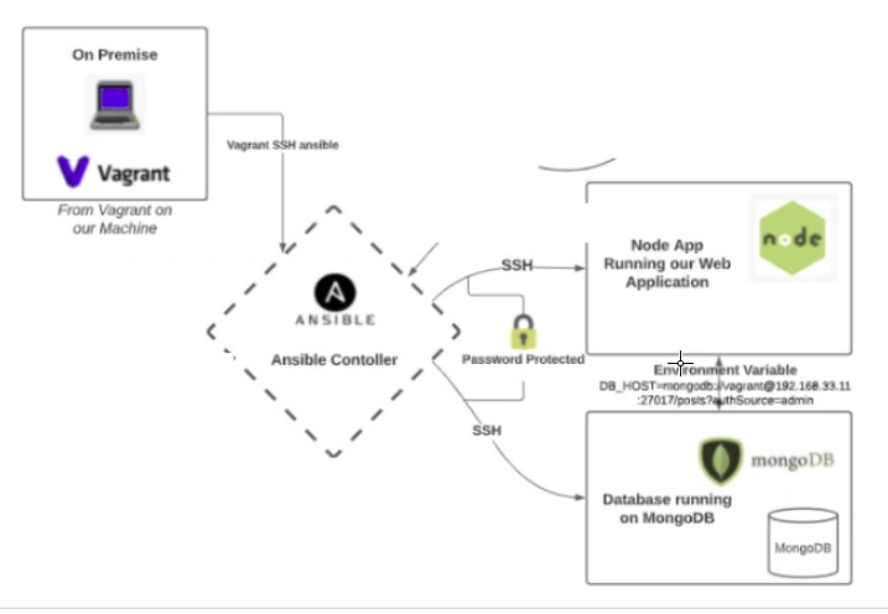

# Infrastructure as Code (IaC)

### What is IaC?

(To codify everything you need to be implemented.)

Infrastructure as Code (IaC) is the managing and provisioning of infrastructure through code instead of through manual processes.

you create configuration files which contain your infrastructure specifications, making it easier to modify and distribute configurations. 

Means you can provision the same environment every time. 

### Benefits

Some of the benefits consist of:

- Cost reduction

- Speed 

- Low risk of human Errors

- Improved consistency

- Eliminate configuration drift

- Improved security strategies 

### Configeration management 

Leading on from the benefit of eliminating configuration drift, IaC can deploy the same code several times, but once the first deployment is done, subsequent ones have no effect. This is why IaC is deemed ‘idempotent’. This is one of the biggest benefits of infrastructure as code for configuration. This feature prevents configuration drift. This means the specifications of your environment are within the code itself.

Hence, if an error occurs which changes a resource or removes an element, your code will remain the same. Any such errors will automatically be corrected without human assistance.

## Ansible 

### What is Ansible?

Ansible is a powerful automation tool, primarily for cross-platform computer support. Its key functions are app deployement, updates on workstations and servers, cloud provisioning and in our case configuration management, but this software has many use cases. 

Some of its benefits are:

- Simple to Learn (Easily understandable python language)

- No Dependencys on agents 

- Playbooks are written in YAML

Playbooks are Ansible configuration files, and the language for writing them is YAML. The interesting factor, in this case, is that YAML is a better alternative for configuration management and automation.

The superiority of YAML over other formats like JSON makes Ansible better configuration management and automation tool. Ansible makes it easy to read and supports comments. Most important of all, it also includes the use of anchors to reference other items.



### Making Our Own IaC with Ansible

1. First thing we need to do is to ensure we have vagrant and virtualbox installed.

<br>

2. We then need to create our vagrant file within our directory with 

```
vagrant init
```

3. Next we need to append this `Vagrantfile` in our directory with the following script, this script creates 3 VM's the controller, the app and the db with some depeddencies already in place like the OS:

```
# -*- mode: ruby -*-
# vi: set ft=ruby :
# All Vagrant configuration is done below. The "2" in Vagrant.configure
# configures the configuration version (we support older styles for
# backwards compatibility). Please don't change it unless you know what
# MULTI SERVER/VMs environment 
#
Vagrant.configure("2") do |config|
  # creating are Ansible controller
     config.vm.define "controller" do |controller|
       
      controller.vm.box = "bento/ubuntu-18.04"
      
      controller.vm.hostname = 'controller'
      
      controller.vm.network :private_network, ip: "192.168.33.12"
      
      # config.hostsupdater.aliases = ["development.controller"] 
      
     end 
  # creating first VM called web  
     config.vm.define "web" do |web|
       
       web.vm.box = "bento/ubuntu-18.04"
      # downloading ubuntu 18.04 image
       web.vm.hostname = 'web'
       # assigning host name to the VM
       
       web.vm.network :private_network, ip: "192.168.33.10"
       #   assigning private IP
       
       #config.hostsupdater.aliases = ["development.web"]
       # creating a link called development.web so we can access web page with this link instread of an IP   
           
     end
     
  # creating second VM called db
     config.vm.define "db" do |db|
       
       db.vm.box = "bento/ubuntu-18.04"
       
       db.vm.hostname = 'db'
       
       db.vm.network :private_network, ip: "192.168.33.11"
       
       #config.hostsupdater.aliases = ["development.db"]     
     end
  
  end

```

4. Once these are up and running on virtualbox, we need to open a new git bash (terminal bash) for each VM and run our update and upgrade commands:

```
sudo apt update -y
sudo apt upgrade -y
```

5. Now we just need to be in the window for the controlller VM, python is already installed so to install ansible we need to input:

```
sudo apt install software-properties-common

sudo apt-add-repository ppa:ansible/ansible

sudo apt update -y

sudo apt install ansible
```

6. Once these are run we can check that ansible is working by ssh'ing into with (password is vagrant):

```
ssh vagrant@<VM IP>
```

7. Once we have established this connection we can exit ansible:

```
exit
```

## Connecting Contoller to Agent Nodes

1. Firstly we need to ssh into our controller and change directories

```
cd /etc/ansible/

ls
```
 
2. If we look at the files in this directory we should have cfg file and hosts. Using the following command we can see the layout of our directory more clearly.

```
sudo apt install tree

tree
```

3. The following command will show the links the controller has with its nodes, we havent configured these yet so when we run this we should initially get an error.

```
sudo ansible all -m ping
```

4. Before we connect them we want to make sure our web and db networks are working so can ssh into both and perform updates and upgrades from our controller as so, ssh into web and provide password : 

```
ssh vagrant@192.168.33.10

sudo apt update -y && sudo apt upgrade -y

exit
```
Now do the same for the db:

```
ssh vagrant@192.168.33.11

sudo apt update -y && sudo apt upgrade -y

exit
```

Shows the network provided by the local host is working. 

## Setting up agent nodes

within `/etc/ansible/` we need to create a group for our nodes.

```
sudo nano hosts 
```

Within this file and:

```
[web]
192.168.33.10 ansible_connection=ssh ansible_ssh_user=vagrant ansible_ssh_pass=vagrant
```

Now when we run 

```
sudo ansible all -m ping
```


We should get green success message with a response of "pong", to add the db group follow the same convention as web but we need to ammend the config file with:


```
sudo nano ansible.cfg 
``` 

then add (NEVER DO THIS IN LIVE ENVIRONMENT)

```
host_key_checking = false
```

```
sudo nano hosts 
```

Create a group 

```
[db]
192.168.33.11 ansible_connection=ssh ansible_ssh_user=vagrant ansible_ssh_pass=vagrant
```


#### Communticating with different nodes

1. This will tell you the date within the nodes

```
sudo ansible all -a "date"
```

2. to send a file from the controller to a specific node we can use ad hoc commands like:

```
sudo ansible web -m copy -a "src=/etc/ansible/testing.txt dest=/home/vagrant"
```

### Create PlayBook 

1. Firstly we need to create a YAML playbook file with:

```
sudo nano install-nginx-playbook.yml
```

2. Within this file add these lines of code:

```
# Creating a playbook to install nginx in web server 

# YAML file starts ---
---

# where would you like to install nginx
- hosts: web

# would you like to see logs
  gather_facts: yes

# do we need admin access - sudo
  become: true

# add the instructions - commands
  tasks:
  - name: Install nginx in web-server


    apt: pkg=nginx state=present
# ensure status is running/active
```
3. We can now run the playbook with the following command:

```
sudo ansible-playbook install-nginx-playbook.yml 
```

If this is successful we should see this 


Or we can check it by communicationg with the node to run a status check with:

```
sudo ansible web -a "systemctl status nginx"
``` 

This will should give us a green "active (running)" response.


## Creating a playbook to run the sparta global app 

1. first we need to make a yaml file to install the dependencies to launch the app

```
sudo nano install-nodejs-playbook.yml
```

Similarly to the above section we can add this to the file:

```
# YAML file starts ---
---

# where would you like to install nodejs
- hosts: web

# would you like to see logs
  gather_facts: yes

# do we need admin access - sudo
  become: true

# add the instructions - commands
  tasks:
  - name: Install Python in web-server


    apt: pkg=python state=present

  - name: Install node in web-server


    apt: pkg=nodejs state=present

  - name: Install npm in web-server


    apt: pkg=npm state=present
```

2. On a fresh bash terminal we need to secure copy the app folder from our local host the web VM:

```
scp -r /Users/reispinnock/Documents/SpartaGlobal/tech221_virtualisation/app vagrant@<your_VM_IP>:/home/vagrant
```

3. Ammend the YAML file to include commands to launch the app

```
# start the app
  - name: Start the application
    command:
      chdir: /home/vagrant/app
      cmd: npm start &
```

4. Start the playbook with 

```
sudo ansible-playbook install-nodejs-playbook.yml 
```

### Connecting other node to mongodb

1. Create a new playbook yaml file to install mongodb

```
sudo nano mongo-db-playbook.yml
```

2. Within this file add this script

```
# YAML file starts
---

# Where do we want to install mongodb
- hosts: db

# Would you like to see logs
  gather_facts: yes

# Do we need admin access - sudo 
  become: true

# Add instructions - commands
  tasks:
  - name: configuring Mongo-db in db agent node
    apt: pkg=mongodb

# Ensure status is running/active
```

3. Run this playbook with:

```
sudo ansible-playbook mongo-db-playbook.yml
```

should see this output


4. Check the status of mongodb with:

```
sudo ansible db -a "systemctl status mongodb"
```

terminal should display a green active(running message)


### Setting up End points (connecting web to db)

1. Within the directory `/etc/ansible` on our controller, we want to access the db using:

```
ssh vagrant@192.168.33.11
```

2. We need to access the mongodb config file with:

```
cd /etc

sudo nano mongodb.conf
```

3. Edit the BindIP to be `0.0.0.0`
<br>
4. We need to restart and enable Mongodb so this change takes place

```
sudo systemctl restart mongodb

sudo systemctl enable mongodb
```

This is all we need to configure in the DB

5. We now need to access the web node with (password = vagrant):

```
ssh vagrant@192.168.33.10
```

6. We now need to create a persistant Environment variable

```
export DB_HOST=mongodb://192.168.33.11:27017/posts
```

we can check its persistant with 

```
printenv DB_HOST
```

This should print the env variable

7. Now we need to change directory and launch the app 

```
cd app

npm install

npm start
```

8. Navigate to web broswer and input `[web_ip]:3000/posts`, and you should see the db has seeded the app.


### Setting up Endpoints with playbooks 

##### DB Playbook 

1. within the controller node and directory `/etc/ansible`, we create a new playbook with:

```
sudo nano mongo-db-conf-playbook.yml
```

2. Within this file we add:

```
# playbook to conf mongodb to machine
---

- hosts: db

  gather_facts: yes

  become: true

# commands to change bindIP to 0.0.0.0

  tasks:

  - name: change bind_ip in mongodb.conf
    lineinfile:
      path: /etc/mongodb.conf
      regexp: 'bind_ip = 1.0.0.0'
      line: 'bind_ip = 0.0.0.0'
      backrefs: yes
```

Where the `regexp` is the line of code we want to ammend from the playbook.

3. Now we need to make a new playbook to add an environment variable within the web 

```
sudo nano  web-db-playbook.yml
```

4. Within this file we can add this code:

```
# playbook to configure web to connect to db
---

- hosts: web


  gather_facts: yes


  become: true

# commands to configure mongodb.conf

  tasks:
  - name: add environment variable
    shell: export DB_HOST=mongodb://192.168.33.11:27017/posts
  ```

5. save both these files, and then run them both:

```
sudo ansible-playbook mongo-db-conf-playbook.yml

sudo ansible-playbook web-db-playbook.yml
```

6. We now need to access the web node with (password = vagrant):

```
ssh vagrant@192.168.33.10
```
7. We can then manually launch the app

```
cd app

npm install

npm start
```

8. Navigate to web broswer and input `[web_ip]:3000/posts`, and you should see the db has seeded the app.


  